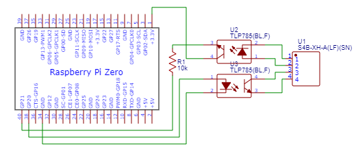

# jem1427-gpio-ts

JEM1427(HA端子、JEM-A端子)をGPIOで操作するためのライブラリです。

## Circuit Diagram


## Parts
* [XHコネクタ ベース付ポスト サイド型 4P](https://akizukidenshi.com/catalog/g/gC-12842/) * 1
* [フォトカプラ TLP785(BLランク)](https://akizukidenshi.com/catalog/g/gI-09846/) * 2
* [カーボン抵抗(炭素皮膜抵抗) 1/4W10kΩ](https://akizukidenshi.com/catalog/g/gR-25103/) * 1
* [L型ピンソケット 1x6](https://akizukidenshi.com/catalog/g/gC-09862/) * 1

## Usage
```ts
// BCM
const GPIO_CONTROL_CHANNEL = 20;
const GPIO_MONITOR_CHANNEL = 21;

const jema = new JEM1427Gpio(GPIO_CONTROL_CHANNEL, GPIO_MONITOR_CHANNEL);
await jema.init();

jema.on('ready', () => {
  console.log('Ready!');
});

jema.on('change', state => {
  console.log(`The door is ${state ? 'locked': 'unlocked'}.`);
});

if (await jema.getMonitor()) { // When the door is locked.
  await jema.sendControl(); // Unlock the door.
}
```
